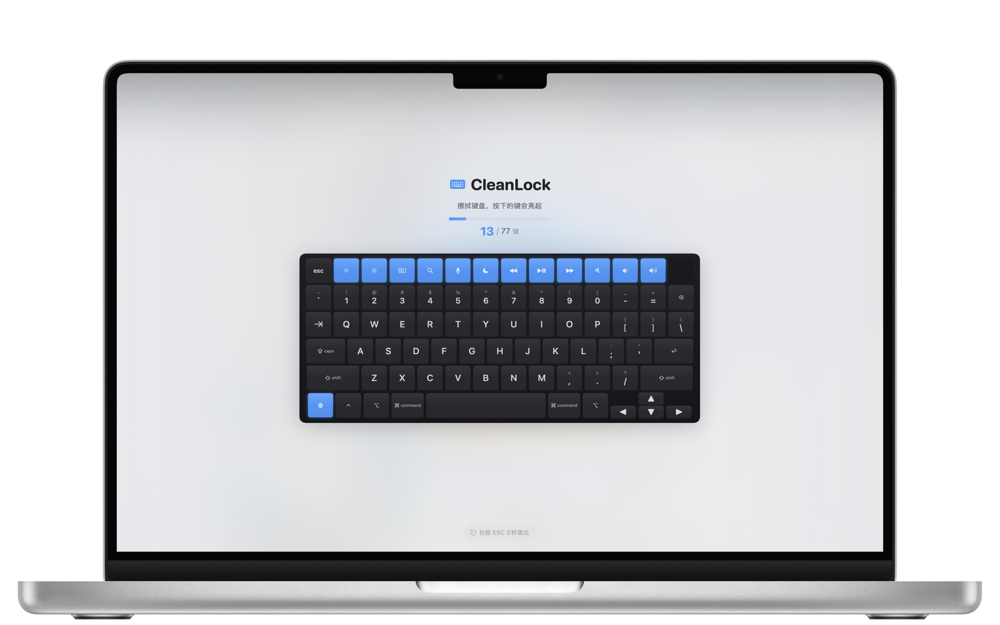

<div align="center">

# CleanLock

**Keyboard Cleaning Assistant for MacBook**

Lock your keyboard and clean every key with confidence

[](https://www.apple.com/macos/)
[](https://swift.org/)
[](LICENSE)

English | [简体中文](README.md)


</div>

---

## Screenshot

<div align="center">

</div>

## Features

- **One-Click Lock** - All key inputs are intercepted during cleaning mode, preventing accidental operations
- **Visual Progress** - Pressed keys light up to show they've been cleaned, ensuring no key is missed
- **Quick Start** - Use `⌘⇧K` global hotkey to enter cleaning mode without opening any window
- **Smart Exit** - Auto-exits when all keys are cleaned, or hold ESC anytime to exit early
- **Multi-language** - Supports English, 简体中文, Español, हिंदी, العربية, Français, Português
- **Native Experience** - Built with pure SwiftUI + AppKit, no third-party dependencies, lightweight

## Requirements

- macOS 13.0 (Ventura) or later
- Supports both Apple Silicon and Intel Mac

## Installation

### App Store

[](https://apps.apple.com/app/cleanlock)

### Build from Source

```bash
# Clone the repository
git clone https://github.com/a9ravic/CleanLock.git
cd CleanLock

# Configure signing (required for first build)
cp local.xcconfig.template local.xcconfig
# Edit local.xcconfig and fill in your development team ID

# Generate Xcode project
make generate

# Build
make build

# Or open in Xcode
make open
```

## Usage

1. Launch CleanLock, the app icon will appear in the menu bar
2. Click the menu bar icon and select "Start Cleaning" or use hotkey `⌘⇧K`
3. The screen will display the keyboard layout, start wiping your keyboard
4. Pressed keys will light up, indicating they have been cleaned
5. Auto-exits after all keys are cleaned, or hold ESC to exit early

## Architecture

```
CleanLock
├── App/                    # App Entry
│   ├── CleanLockApp.swift  # SwiftUI App entry point
│   └── AppDelegate.swift   # Window and lifecycle management
├── Views/                  # SwiftUI Views
│   ├── CleaningView.swift  # Cleaning mode main interface
│   ├── KeyboardView.swift  # Keyboard layout view
│   └── KeyCapView.swift    # Individual key view
├── Services/               # Core Services
│   ├── SandboxKeyInterceptor.swift  # Keyboard event interception
│   └── HotKeyManager.swift          # Global hotkey
├── Models/                 # Data Models
│   ├── KeyboardLayout.swift    # Keyboard layout definition
│   └── CleaningState.swift     # Cleaning state management
└── Theme/                  # Design System
    └── DesignSystem.swift  # Colors, fonts, animations
```

### Design Highlights

- **App Sandbox Compatible** - Uses `NSEvent.addLocalMonitorForEvents` for keyboard interception, no accessibility permission required
- **State Machine Driven** - Cleaning flow managed by state machine: `idle → cleaning → completed → exiting`
- **SwiftUI + AppKit Hybrid** - AppKit for window management, SwiftUI for UI

## Development

```bash
# Run tests
make test

# Clean build artifacts
make clean

# Regenerate project
make generate
```

## Contributing

Issues and Pull Requests are welcome!

1. Fork this repository
2. Create a feature branch (`git checkout -b feature/amazing-feature`)
3. Commit your changes (`git commit -m 'Add amazing feature'`)
4. Push to the branch (`git push origin feature/amazing-feature`)
5. Open a Pull Request

## License

This project is licensed under the MIT License - see the [LICENSE](LICENSE) file for details

## Links

- [Official Website](https://cleanlock.agravic.dev/en/)
- [Issue Tracker](https://github.com/a9ravic/CleanLock/issues)
